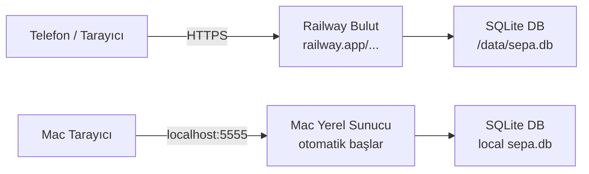

## Hedef
Uygulamayı hem Railway'de her zaman erişilebilir (mobil dahil) hem de Mac'te otomatik başlayacak şekilde yapılandır. Backtest ve portföy verileri SQLite'a taşınarak bulutta kalıcı hale getirilir.

---

## Mimari



---

## Adım 1 — SQLite Katmanı (`storage.py`) — Yeni Dosya

Mevcut JSON/CSV dosya sistemini SQLite'a taşıyan bir yardımcı modül.

- Tablo: `backtests` → `id, name, created_at, params_json, report_json`
- Tablo: `portfolios` → `id, name, ticker, cost_basis, shares, purchase_date, notes`
- Tablo: `signals` → `id, created_at, data_json`
- `DB_PATH` env variable'dan okunur; yoksa `./sepa.db` kullanılır
- `init_db()` fonksiyonu — tablolar yoksa oluşturur (app başlarken çağrılır)

## Adım 2 — `app.py` Güncelleme

Dosya tabanlı okuma/yazma işlemlerini `storage.py` çağrılarıyla değiştir:

| Mevcut | Yeni |
|--------|------|
| `json.dump` → `backtests/*.json` | `storage.save_backtest(id, name, params, report)` |
| `json.load` → `backtests/*.json` | `storage.get_backtest(id)`, `storage.list_backtests()` |
| `os.remove` → backtest dosyası | `storage.delete_backtest(id)` |
| `df.to_csv` → `portfolios/*.csv` | `storage.save_portfolio_positions(name, rows)` |
| `pd.read_csv` → `portfolios/*.csv` | `storage.get_portfolio(name)` |
| `sepa_signal_history.json` | `storage.save_signal()`, `storage.list_signals()` |

- `data_cache/` (`.pkl` dosyaları) **taşınmaz** — bunlar geçici performans cache'i, ephemeral olması sorun değil
- `BACKTESTS_DIR`, `PORTFOLIOS_DIR` sabit tanımları kaldırılır

## Adım 3 — `requirements.txt` Güncelleme

```
flask==3.0.0
python-dotenv>=1.0.0
flask-cors==4.0.0
yfinance==0.2.36
pandas==2.1.4
numpy==1.26.3
requests==2.31.0
gunicorn>=21.0          # Railway için production WSGI
twelvedata>=1.2.0       # mevcut kullanım
dateutil>=2.8.2
```

`pywebview` ve `pyinstaller` Railway'e gönderilmez (sadece masaüstü için) → `requirements-desktop.txt`'e taşınır.

## Adım 4 — Railway Yapılandırma Dosyaları

**`Procfile`** (yeni):
```
web: gunicorn app:app --bind 0.0.0.0:$PORT --workers 1 --timeout 120
```

**`railway.toml`** (yeni):
```toml
[build]
builder = "nixpacks"

[deploy]
startCommand = "gunicorn app:app --bind 0.0.0.0:$PORT --workers 1 --timeout 120"
healthcheckPath = "/"
restartPolicyType = "on_failure"
```

## Adım 5 — Ortam Değişkenleri

`app.py`'de port dinamik olarak alınır:
```python
port = int(os.environ.get('PORT', 5555))
app.run(host='0.0.0.0', port=port)
```

Railway'de ayarlanacak environment variables:
| Değişken | Değer |
|----------|-------|
| `TWELVEDATA_API_KEY` | `e7e92117...` (mevcut key) |
| `DB_PATH` | `/data/sepa.db` (Railway Volume mount noktası) |

## Adım 6 — Railway Volume (Kalıcı Disk)

> SQLite tek dosya olduğu için Railway'in ücretsiz planındaki **1 GB Volume** yeterlidir (~$0, ilk 1 GB ücretsiz).

Railway Dashboard'da:
1. Proje → **Volumes** → **Add Volume**
2. Mount Path: `/data`
3. `DB_PATH=/data/sepa.db` env variable'ı set et

## Adım 7 — Mac Otomatik Başlatma (Login Item)

Türkçe karakter sorunundan kaçınmak için `launchd` yerine **macOS Login Items** kullanılır.

**`start_sepa.sh`** (yeni, `~/` altında oluşturulur):
```bash
#!/bin/bash
cd "/Users/hakanficicilar/Documents/Aİ/MARK MİNERVİNİ"
python3 app.py >> /tmp/sepa.log 2>&1
```

**AppleScript App Wrapper** (`SEPA Starter.app`):
```applescript
do shell script "bash /Users/hakanficicilar/start_sepa.sh &"
```

Aktivasyon:
- `System Settings → General → Login Items → +` → `SEPA Starter.app` ekle
- Mac her açıldığında otomatik başlar, terminal gerektirmez

## Adım 8 — Mevcut Verilerin Taşınması

Migration script (`migrate_to_sqlite.py`):
- `backtests/*.json` → SQLite `backtests` tablosuna
- `portfolios/*.csv` → SQLite `portfolios` tablosuna
- Yerel çalıştırmada bir kez çalıştırılır, ardından silinebilir

---

## Doğrulama (Definition of Done)

| Kontrol | Beklenti |
|---------|----------|
| `python3 app.py` | localhost:5555 çalışıyor, SQLite'tan veri okuyor |
| `migrate_to_sqlite.py` | Mevcut backtest ve portföyler kaybolmadan taşındı |
| Railway deploy | `https://xxx.railway.app` telefondan açılıyor |
| Railway restart sonrası | Backtest ve portföyler hâlâ görünüyor (Volume kalıcı) |
| Mac Login Item | Bilgisayar açıldığında otomatik localhost:5555 başlıyor |

---

## Etkilenen Dosyalar

| Dosya | İşlem |
|-------|-------|
| `storage.py` | Yeni — SQLite CRUD katmanı |
| `app.py` | Güncelleme — dosya I/O → storage.py çağrıları |
| `requirements.txt` | Güncelleme — gunicorn ekle, pywebview/pyinstaller çıkar |
| `requirements-desktop.txt` | Yeni — pywebview, pyinstaller |
| `Procfile` | Yeni |
| `railway.toml` | Yeni |
| `migrate_to_sqlite.py` | Yeni — tek seferlik migration |
| `~/start_sepa.sh` | Yeni — Mac auto-start script |
| `SEPA Starter.app` | Yeni — Login Item wrapper |
